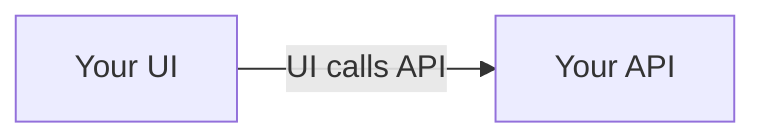
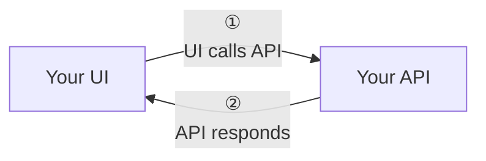
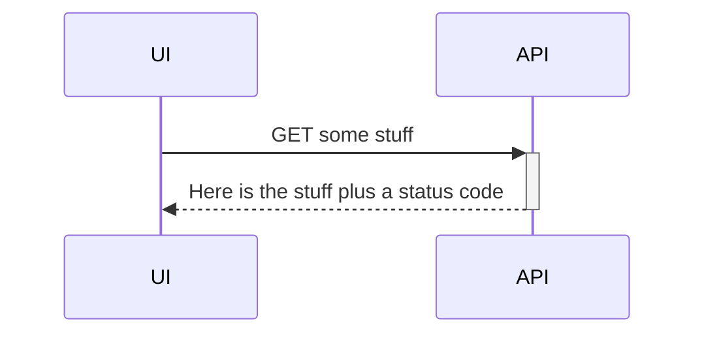
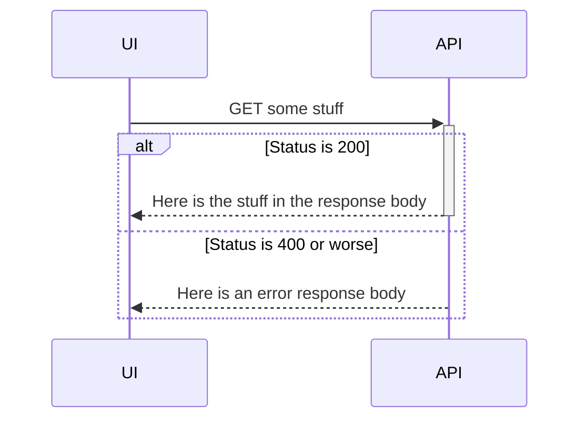
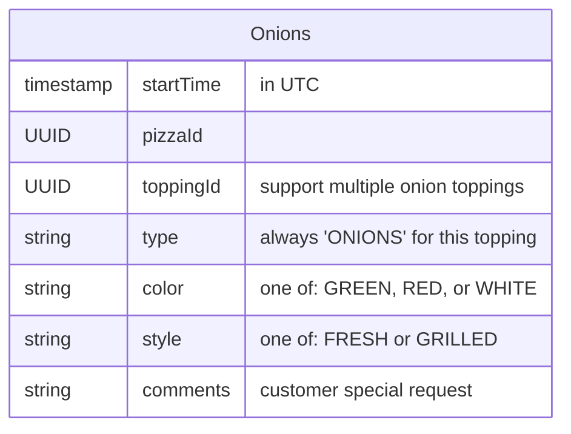
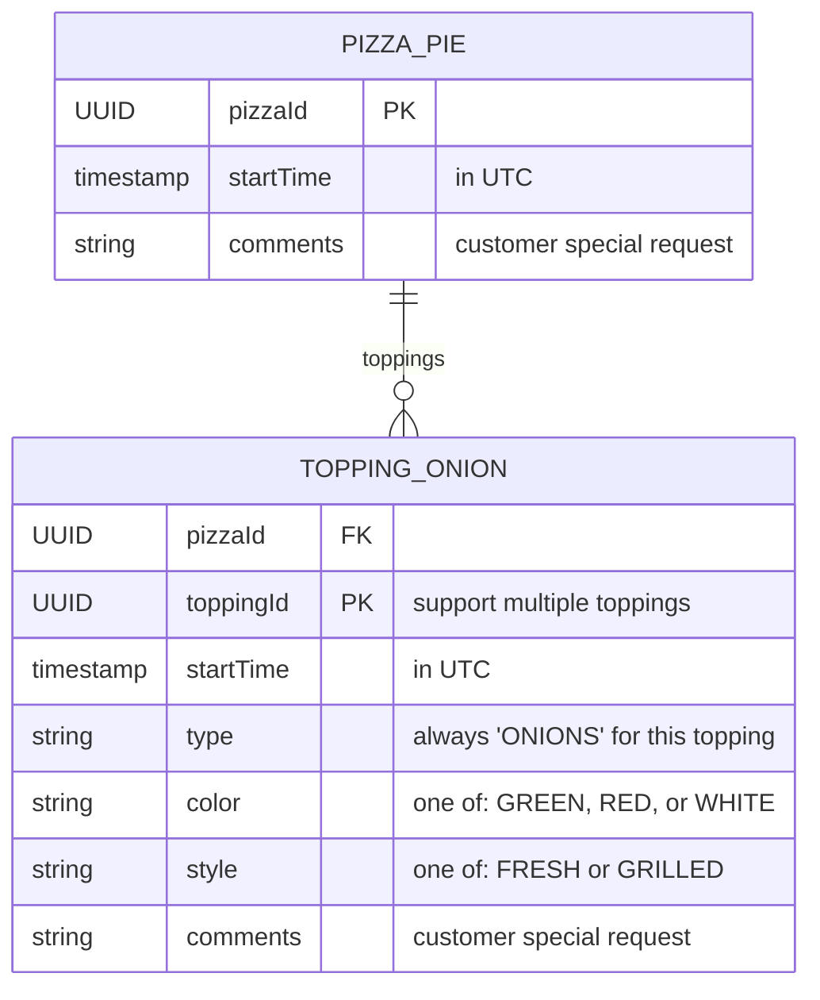

_Everyone loves diagrams!_

Be liberal in the use of diagrams in your wiki.
It is a solid feature of GitHub, and you should take advantage of what your
tools provide you.

> [!TIP]
> In general as you edit diagrams in the wiki, the GitHub web UI experience
> works better as you can toggle between editing and previews:

## OK, but where I can learn more about diagramming in my wiki?

Your key goto resource on Mermaid is [_About
Mermaid_](https://mermaid.js.org/intro/) (the documentation for each diagram
type).
* Typically, in architecture you use the
  [_Flowchart_](https://mermaid.js.org/syntax/flowchart.html) type which shows
  relationships among parts of your system; this is the kind of diagram you
  might draw on a whiteboard
* [_Sequence Diagram_](https://mermaid.js.org/syntax/sequenceDiagram.html) is
  helpful to clarify the order of interactions
* [_Entity Relationship
  Diagram_](https://mermaid.js.org/syntax/entityRelationshipDiagram.html) is
  great for documenting your database, and works to describe structure and
  properties in your JSON
* For developers working in the code base, [_Class
  Diagram_](https://mermaid.js.org/syntax/classDiagram.html) is a classic but
  not typically shown outside your team

Additionally, you may want to show a sequence in plain diagrams (flowcharts).
A great resource is UNICODE which has "circled numbers" you can use.
Start with ["circle 1"](https://graphemica.com/%E2%91%A0) and progress to 2,
3, etc. as needed.
There are other excellent characters you can paste directly into your wiki
such as ["point up"](https://graphemica.com/%E2%98%9D).
Typically your browser for [Graphemica](https://graphemica.com) shows a
copy/pastable character in the URL bar.

## Simple flowchart example

Here is a simple diagram (flowchart) with Mermaid.
You can embed this directly in your wiki documentation using a code fence. 
You may find that reordering nodes and relationships gives a better overall
diagram.

Typically, I only show one side of this interaction to emphasize dependencies,
and reserve the back and forth for [_sequence
diagrams_](#simple-sequence-diagram-example):

If your interactions are multiple and complex, you can use UNICODE "circled
numbers" to help the reader follow:

## Simple sequence diagram example

Here is a simple sequence diagram with Mermaid.
You can embed this directly in your wiki documentation using a code fence. 
You may find it more helpful to use sequence diagrams only for deep diving into
specific interactions;
some readers may find the level of detail overwhelming, and others will love
you for it.

Here is the same interaction but [with success/failure HTTP status
codes](https://mermaid.js.org/syntax/sequenceDiagram.html#alt):

> [!NOTE]
> Mixing `+`/`-` to call out complete interactions does not work the same when
> using `alt` to show errors.
> You can only complete the interaction from one side of "alternatives";
> I typically pick the happy path for this.

## Simple ERD diagram example

I typically use ERD diagrams to:
- Do the classic thing of describing SQL tables and their relationships
- Visually represent JSON to explain the properties

Here is a simple ERD diagram to represent JSON with Mermaid:

Here is the example expanded to show a database design:

> [!TIP]
> See ["Relationship
> Syntax"](https://mermaid.js.org/syntax/entityRelationshipDiagram.html#relationship-syntax)
> in Mermaid for representing other entity or table relationships.
