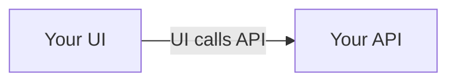
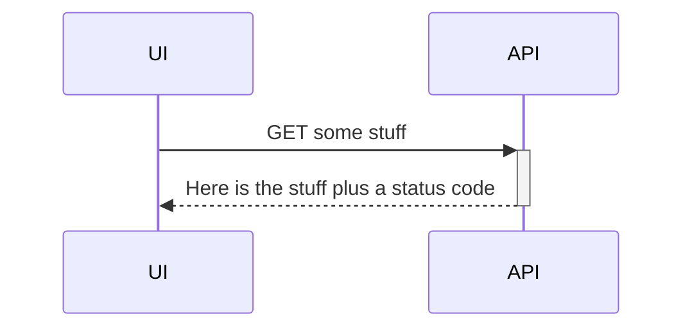

In general as you edit diagrams in the wiki, the GitHub web UI experience
works better as you can toggle between editing and previews:

You key goto resource on Mermaid is [_About
Mermaid_](https://mermaid.js.org/intro/) (the documentation for each diagram
type).
* Typically in architecture you use the
  [_Flowchart_](https://mermaid.js.org/syntax/flowchart.html) type which shows
  relationships among parts of your system; this is the kind of diagram you
  might draw at a whiteboard
* [_Sequence Diagram_](https://mermaid.js.org/syntax/sequenceDiagram.html) is
  helpful to clarify the order of interactions
* [_Entity Relationship
  Diagram_](https://mermaid.js.org/syntax/entityRelationshipDiagram.html) is
  great for documenting your database, and works to describe structure and
  properties in your JSON
* For developers working in the code base, [_Class
  Diagram_](https://mermaid.js.org/syntax/classDiagram.html) is a classic but
  not typically shown outside your team

## Simple flowchart example

Here is a simple diagram (flowchart) with Mermaid.
You can embed this directly in your wiki documentation using a code fence. 
You may find that reordering nodes and relationships gives a better overall
diagram.

Typically I only show one side of this interaction to emphasize dependencies,
and reserve the back and forth for [_sequence
diagrams_](#simple-sequence-diagram-example):

## Simple sequence diagram example

