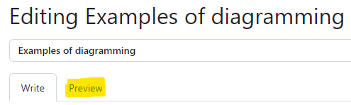
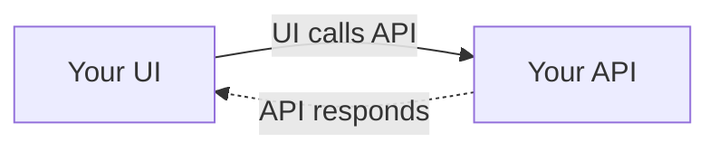
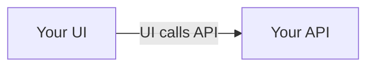
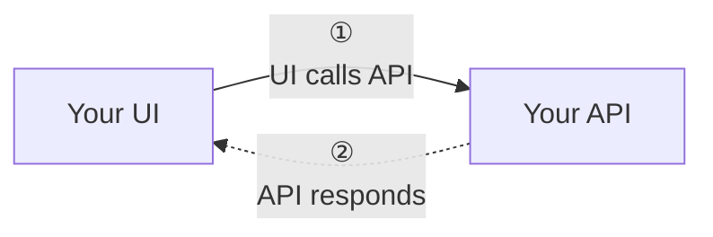
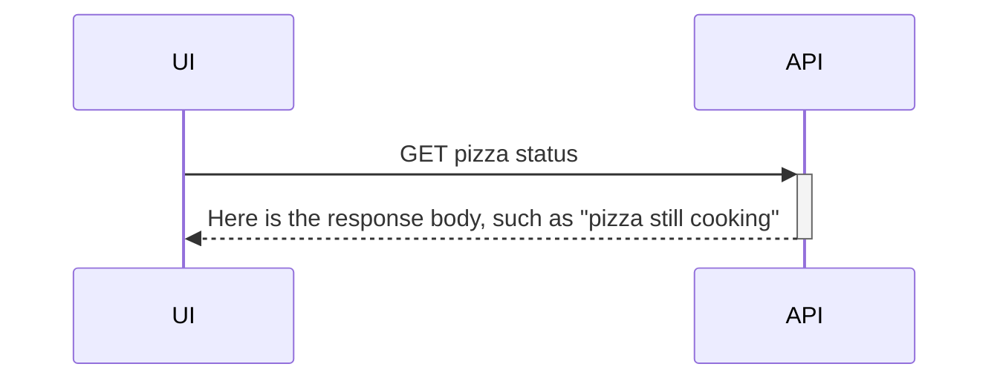
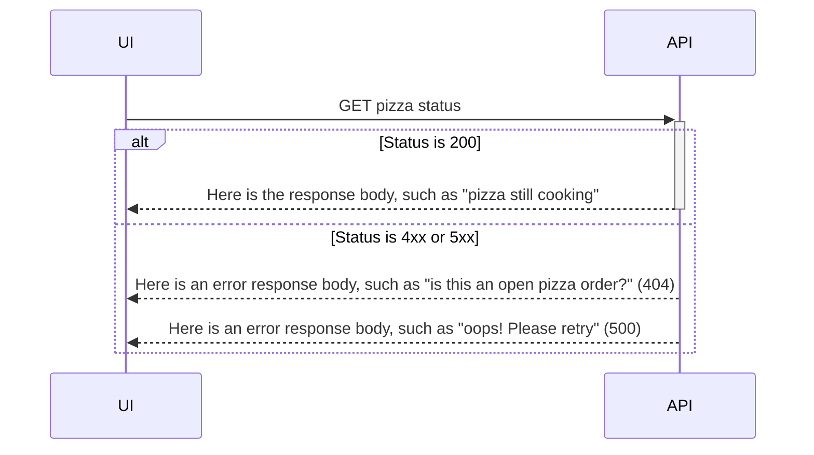
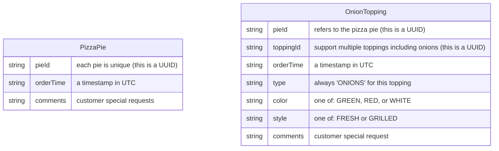
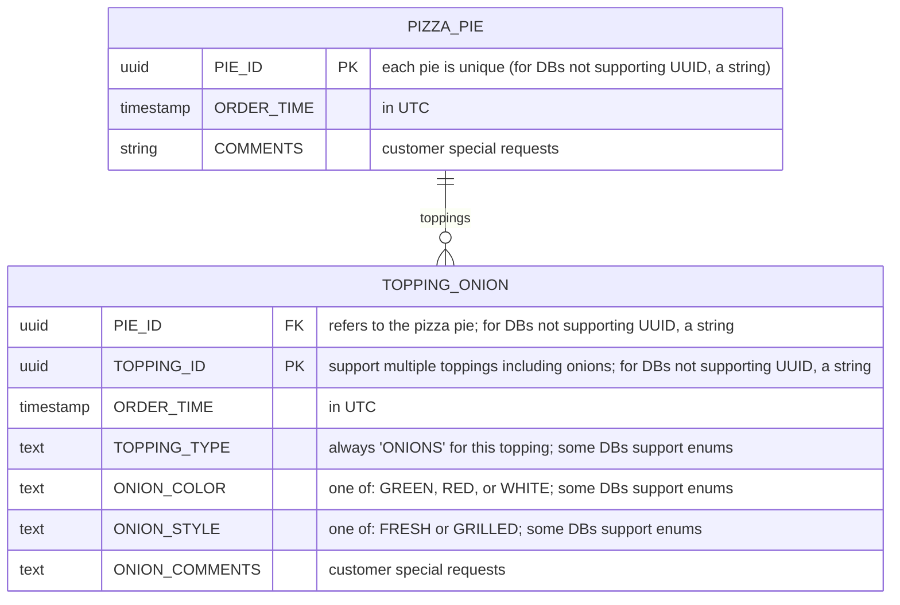

_Everyone loves diagrams!_

Be liberal in the use of diagrams in your wiki.
These rely on use of `Mermaid.js` syntax embedded in your pages.
It is a solid feature of GitHub, and you should take advantage of what your
tools provide.

> [!TIP]
> In general as you edit diagrams in the wiki, unless you are comfortable with
> direct syntax editing and visualizing the results, the GitHub web UI
> experience is better as you toggle between "Write" (edit) and "Preview"
> modes:

## OK, but where I can learn more about diagramming in my wiki?

Your key goto resource on Mermaid is [_About
Mermaid_](https://mermaid.js.org/intro/) (the documentation for each diagram
type).
* Typically, in architecture you use the
  [_Flowchart_](https://mermaid.js.org/syntax/flowchart.html) type to show
  relationships among parts of your system; this is the kind of diagram you
  might draw on a whiteboard.
* [_Sequence Diagram_](https://mermaid.js.org/syntax/sequenceDiagram.html) is
  helpful to clarify the order of interactions. A typical example is a UI
  "lane" on the left, your API in the middle, and a DB on the right.
* [_Entity Relationship
  Diagram_](https://mermaid.js.org/syntax/entityRelationshipDiagram.html) is
  great for documenting your database and also your JSON structure and
  properties.
* For developers working in the code base, [_Class
  Diagram_](https://mermaid.js.org/syntax/classDiagram.html) is a classic but
  not typically shown outside your team.

## Simple flowchart example

Here is a simple diagram (flowchart) with Mermaid.
You can embed this directly in your wiki documentation using a code fence.
You may find that reordering nodes and relationships gives a better overall
diagram.

Typically, I only show one side of this interaction to emphasize dependencies,
and reserve the back and forth for [_sequence
diagrams_](#simple-sequence-diagram-example):

If your interactions are multiple and complex, you can use [UNICODE "circled
digits"](https://graphemica.com/search?q=circled) to help the reader follow:

See [_A tip on special
characters_](Using-the-templates#a-tip-on-special-characters) for using 
"circled numbers" in diagrams.

## Simple sequence diagram example

Here is a simple sequence diagram with Mermaid.
You can embed this directly in your wiki documentation using a code fence.
You may find it more helpful to use sequence diagrams only for deep diving
into specific interactions;
some readers may find the level of detail overwhelming, and others will love
you for it.

Here is the same interaction but [with success/failure HTTP status
codes](https://mermaid.js.org/syntax/sequenceDiagram.html#alt):

> [!NOTE]
> Mixing `+`/`-` to call out complete interactions does not work the same when
> using `alt` to show errors.
> You can only complete the interaction from one side of "alternatives";
> I typically pick the happy path for this, and call out sad paths as
> alternatives.

## Simple ERD diagram example

I typically use ERD diagrams to:

- Do the classic thing of describing SQL tables and their relationships
- Visually represent JSON to explain the properties

Here is a simple ERD diagram to represent JSON with Mermaid:

Here is the example expanded to show a SQL design:

> [!TIP]
> You shoud update ERD diagrams to match the features in your database, such
> as support for UUIDs and timestamps (in UTC).

> [!TIP]
> See ["Relationship
> Syntax"](https://mermaid.js.org/syntax/entityRelationshipDiagram.html#relationship-syntax)
> in Mermaid for representing other entity or table relationships.
