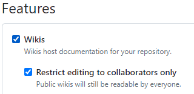

> Welcome to the wiki-docs wiki!

The above is the default starting content when you use the "wiki" feature in
GitHub.
It lives in your [`Home.md`](Home) page.

## Why a GitHub wiki for your project?

Firstly, a wiki in GitHub is for _developers_, _architects_, _business
analysts_, and other tech-minded folks.
**Not everyone is comfortable with GitHub.**
A GitHub wiki is best for _technical documentation_ targeting appropriate
readers.
In open source, or proprietary technical projects, your "tech-minded business
folks" are also consumers (direct or indirect) of your project.

Secondly, a GitHub wiki is **not** for _business_ folks!
These will prefer other document types and styles, such as documents (Word,
GDocs), spreadsheets (Excel, GSheets), presentations (PowerPoint, GSlides),
and sketch boards (Mural and ilk).
In open source projects, this is less of a concern, and target audiences are 
usually technically savvy.

> [!TIP]
> You may find it helpful to view your wiki pages _locally_ while you edit
> them (if preferring local editors to the GitHub UI editor).
> If so, tools are available to you.
> My choices include:
> * IntelliJ &mdash; Good editing tools and views wiki diagrams out of the
>   box.
> * VSCode &mdash; Good editing tools and with extensions supports viewing
>   wiki diagrams.
> * Command line &mdash; A good viewing tool is
>   [`mdv`](https://github.com/binkley/shell/blob/master/mdv) but without
>   support for wiki diagrams.
>   It depends on [`pandoc`](https://pandoc.org/) and the command-line browser
>   of your choice (`lynx` by default).

### What a GitHub wiki is good for

- Any _open source_ project with code in GitHub
- Documentation outside your source code such as your APIs
- Diagrams: for sharing with developers, architects, business, and others
- Capture of discussions such as ADRs (architecture decision records)
- Keeping documentation under source control, just like your program code
- _Most importantly_, let anyone&mdash;developers or others&mdash;edit
  documentation easily, and in _plain language text_ 

### What a GitHub wiki is _not_ good for

- Storing proprietary documents; use links in the wiki for references to
  external documents.
  You can store these in the GitHub wiki repository, but it may not fit your
  needs
- Complex diagrams relying on special features of particular tools.
  Mermaid (out-of-the-box with GitHub wikis) is an [excellent
  tool](https://mermaid.js.org/intro/), but may not have the feature set you
  want
- Large wikis with many pages needing organization: a GitHub wiki is a flat
  page structure (see [GitHub
  discussion](https://github.com/orgs/community/discussions/23914)).
  Organizing structure is through the _Navigation sidebar_
- Documentation access for business users unfamiliar with GitHub

## Getting started

If your GitHub project does not yet have a wiki, go to the "Wiki" option in
the GitHub UI for your project (it appears midway in the top navigation bar)
and create the default "Home" page.
If you do not see the "Wiki" option, you may need a project owner or
administrator to enable the option in "Settings | General":

After your wiki is ready, see [[Working with the GitHub wiki]] or look at
the sample wiki pages below.

## Getting started

To use a wiki in your GitHub project, see [_Documenting your project with
wikis_](https://docs.github.com/en/communities/documenting-your-project-with-wikis).

You may need to enable this feature in your project settings:

## Sample wiki pages

A good resource for getting started or exploring wiki features available to
you is [Getting started with writing and formatting on
  GitHub](https://docs.github.com/en/get-started/writing-on-github/getting-started-with-writing-and-formatting-on-github).

### Documenting your REST API calls

For documenting your REST endpoints and JSON content, start with these two
pages, and then rename/edit:

* [[Template REST API]] &mdash; document your REST endpoints
* [[Template JSON Models]] &mdash; document your JSON payloads
* [[Template Constants]] &mdash; document your manifest constants

You will rename these to remove the "Template" prefixes, and can provide your
readers with "REST API" and "JSON Models" wiki documentation pages.

> [!NOTE]
> You may want to update your "Sidebar" (right-hand side in the GitHub wiki
> UI) to highlight these and other pages.
> The example `_Sidebar.md` talks about this.

### Diagramming your architecture

* [[Examples of diagramming]] &mdash; take advantage of Mermaid in your
  documentation

> [!NOTE]
> The above `[[Page Name]]` syntax uses GitHub markdown features (as does this
> `[!NOTE]`).
> In vanilla Markdown the page links are:
> * [Template REST API](./Template-REST-API.md)
> * [Template JSON Models](./Template-JSON-Models.md)
> * [Template Constants](./Template-Constants.md)
> * [Examples of diagramming](./Examples-of-diagramming.md)
