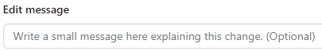
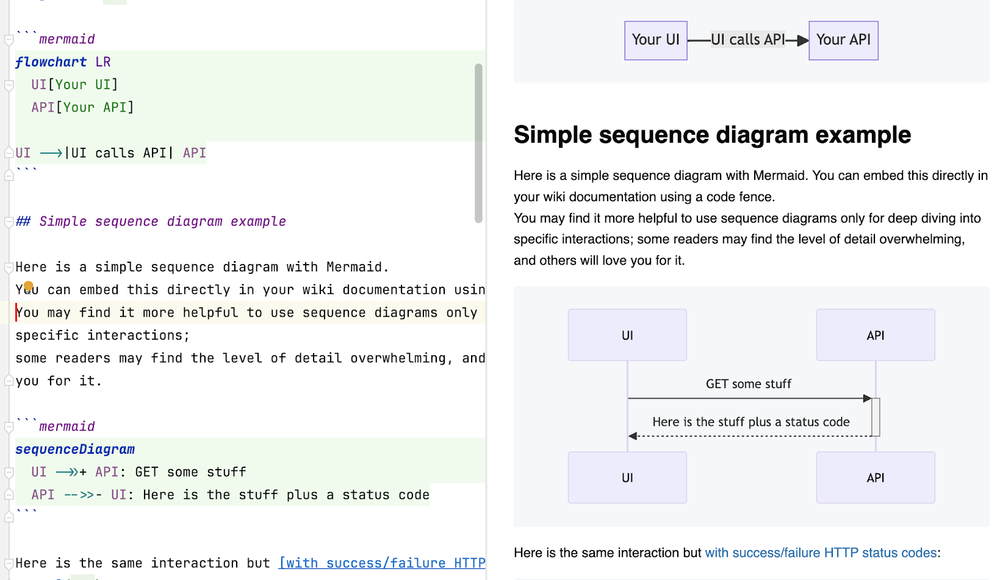
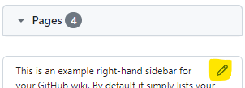
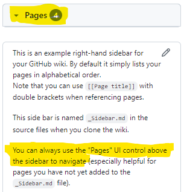

# Working with the GitHub wiki

## Working locally on your machine

You can _clone your wiki_: it is a repository in GitHub separate from your
code repository but attached to it in the GitHub UI.

For this project, the clone URL is:
`git@github.com:binkley/wiki-docs.wiki.git`.<br/>
Note the ".wiki" added after your code repo URL.
(See GitHub's [_Cloning wikis to your
computer_](https://docs.github.com/en/communities/documenting-your-project-with-wikis/adding-or-editing-wiki-pages#cloning-wikis-to-your-computer).)

I like to edit the wiki locally, and take advantage of my IDE (such as
[IntelliJ](https://www.jetbrains.com/help/idea/markdown.html) or
[VSCode](https://code.visualstudio.com/docs/languages/markdown)) and the
command line, but it is up to you what works best.
See [below](#adding-images-and-screenshots-to-a-wiki-page) for a case when to
switch back to the GitHub web UI.

See [_Making the most of your editor_](#making-the-most-of-your-editor).

## About your workflow

When editing locally, and checking how it actually looks in GitHub, you will
find different _[git
workflows](https://www.atlassian.com/git/tutorials/comparing-workflows)_
useful.
For this sample wiki, I use a simple "push on main" workflow:

```sh
$ git commit -m 'Some message'
$ git push
```
or for simple corrections after visual checking in GitHub:

```sh
$ git commit --amend --no-edit
$ git push --force-with-lease
```

With a team, or when tracking documentation changes (say integration or
external publishing), you will want something more helpful.

## About commit messages

When you edit in the GitHub UI, the default commit message looks like:

> Updated \<a page name such as "HOME"\> (markdown)

You can give a commit message in the UI at the bottom of the page:<br>


And you can always give a meaningful commit message when working locally with
`git commit -m <your message>` (and then pushing your change).

## Making the most of your editor

Most IDEs these days support Markdown, and several can show previews right in
the editor.
Below is not a comprehensive list, just those I've tried this with.

### JetBrains

IntelliJ and the other JetBrains IDE products all support Markdown with
preview either out-of-the-box or with a free plugin download supported by
JetBrains.
Even nicer, JetBrains has a Mermaid (diagrams) plugin that seamlessly works
with the Markdown editor and with page preview.
Mermaid is the text-based diagramming tool used in GitHub wikis among other
places.

Here is a sample screenshot:<br>


## Adding images and screenshots to a wiki page

You can add images by editing with the GitHub web UI for the wiki and pasting
directly into the edit box.
The UI automatically uploads the image, and inserts a link for you.
However, the uploaded go into an "assets" area not part of the wiki repository,

There is an _preferred_ alternative:
Add your image to your wiki repository, and link directly with
``.
This also has the benefit of keeping your images as content in under source
control, and supporting external tools such as converting your wiki to PDF.

## Changing the right-hand navigation sidebar in GitHub UI

You may want to organize your wiki documentation pages.
GitHub lets you do this by customizing the right-hand navigation _Sidebar_
that appears in the GitHub UI.

To edit the Sidebar in the GitHub UI, use the "crayon" icon:<br/>


If you customize the sidebar, readers can still find all pages&mdash;even
those you did not list:<br/>


Locally the right-hand navigation sidebar is the `_Sidebar.md` file in your
wiki repo clone, and editing this file locally works as expected; however, you
may find the GitHub editor better for seeing how your changes lay out.
